

# Description

This repository contains sample code that helps you to create boiler plate coding for the ABAP RESTful Application Programming Model (RAP) in SAP BTP, ABAP environment, SAP S/4HANA 2021 and SAP S/4HANA 2020.  

## What's new 

- Move from namespace /DMO/ to "namespace" ZDMO_
- The RAP Generator now comes with a RAP Business object ZDMO_I_RAPGENERATORBO (RAP generates RAP :-))
- The RAP Generator can be used using the Fiori Elements UI preview
- Downport to SAP S/4HANA 2020
- Draft tables are now automatically generated without having to specify the table names upfront    
- Support for unmanaged RAP BO's with custom entities for the following data source types  
- Abstract entities which are for example being generated when a Service Consumption Model is created   
- Support for Multi-Inline-Edit (see [Blog Post - Generating SAP Fiori table maintenance dialogs using the RAP Generator](https://blogs.sap.com/2021/08/23/generating-sap-fiori-table-maintenance-dialogs-using-the-rap-generator/).
 
## Motivation

The basic idea behind the *RAP Generator* is to make it easier for the developer to create the complete stack of objects that are needed to implement a RAP business object. The goal is to generate most of the boiler plate coding so that the developer can start more quickly to implement the business logic.  

As an input the RAP Generator uses a JSON file which also reflects the tree structure of a RAP business object. This way all necessary input data is entered upfront and can be reused to create similar RAP business objects, for example for testing or training purposes. 

Since it turned out that maintaining the JSON file is quite complex now a SAP Fiori Elements UI based on a RAP business object was added that provides value helps for the data that has to be entered, so the RAP Generator works now similar like the well known key user tools. 

Since the Fiori Elements Preview is used there is no need to deploy an app.

## How to use the RAP Generator  

(work in progress)

Working with the RAP Genertor now works (in short) as follows:

1. Open the service binding `ZDMO_UI_RAPGENERATOR_O2` and double-click on the entity **RAPGeneratorProjects** to start the Fiori Elements preview 
2. Press the button **New Project**
3. Select a **name** for the root entity and a **package** where the repository objects will be generated
4. Select the header data for your project such as whether we are dealing with a managed scenario with uuid based key fields and what kind of data source is used (tables, cds views or abstract entities)
5. Start to build the composition tree of your RAP BO
   a. Enter a data source for your root entity
   b. Specifiy which fields of your data source are used as the semantic key or as the total etag
6. To add child nodes select the parent node and press the button **Add Child** and do what has been described in step 5.

### Start Fiori Elements Preview

- Press Ctrl+Shift+A to start the Open ABAP Development Object dialogue  
- Open the service binding `ZDMO_UI_RAPGENERATOR_O2  
  1. Select the entity **RAPGeneratorProjects**  
  2. Press the **Preview** button  
  
### Create a new RAP Generator project  

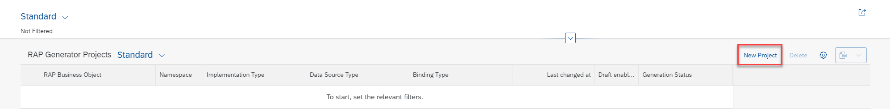
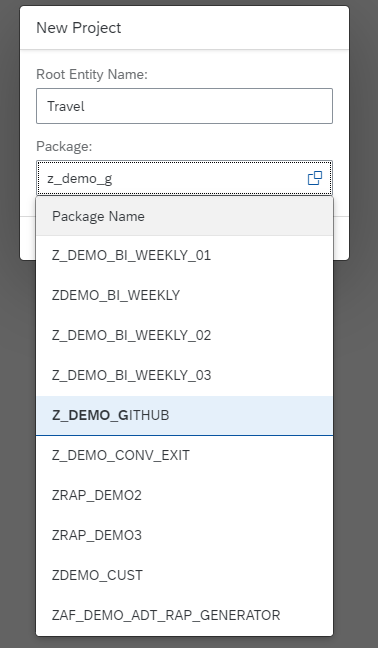

- Press the **Create Project** button
- Enter the following
  1. The **name** of your root entity
  2. Select the **package** where your RAP business object will be generated. Please note that type ahead support is present.
  
### Maintain header data for your RAP Generator project

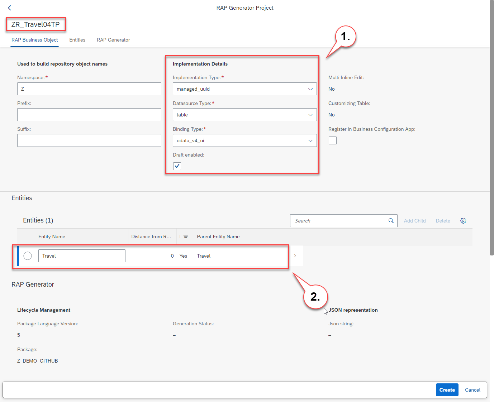

On the object page we see that the generator has selected **ZR_Travel04TP** a proposal for a unique name of our new RAP business object which follows the naming conventions of SAP S/4HANA. It basically uses the name of the root entity **Travel**, takes the namespace **Z**, uses the prefix **R_** for so called reuse views, uses the suffix **TP** for transactional processing and adds **04** to the root bo name since I already created several objects with the root entity name Travel.   

As a default the generator suggest to create a RAP business object that uses tables as data source that have **UUID based key fields** and that uses a **managed implementation**. For this in the drop down box **Implementation Type** the value **managed_uuid** is pre selected.   
In addition **table** is pre-selected as the **Datasource Type** and **odata_v4_ui** as the **Binding Type** and the check box **Draft enabled** is marked.  

**Datasources**

As datasources the RAP generator supports **table**, **cds_view** and **abstract_entity**.

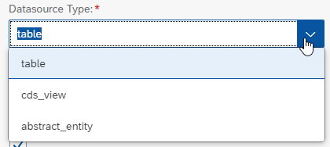

As Implementation type the following values can be set **managed_uuid**, **managed_semantic** or **unmanaged_semantic**.

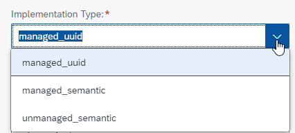  

For the binding type you can select one of the following values **odata_v4_ui**,  **odata_v2_ui**, **odata_v4_web_api** or  **odata_v2_web_api**.

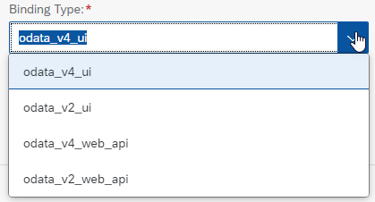

For **green field scenarios** a developer usually will choose the implementation type managed_uuid. That means tables will be used as a data source that have uuid based keys, so that a managed scenario can be used where no code needs to be implemented for the CRUD operations and earyl numbering can be used. The only thing that is left for the developer is to implement determinations, validations and actions. 

For **brownfield scenarios** where existing business logic does exist to create, update and delete business data the implementation type **unmanaged_semantic** can be used. This generates an unmanaged scenario that uses tables with semantic keys.

As a second data source the RAP generator supports **CDS views**. This way it is possible to create RAP business objects based on existing CDS views. 

As a third data source there is now support for **abstract entities**. Through the support of abstract entities you can generate a RAP BO based on the abstract entities that are generated when a service consumption model is created. Here the implementation type  **unmanaged_semantic** has to be used. 

### Maintain details for the root entity

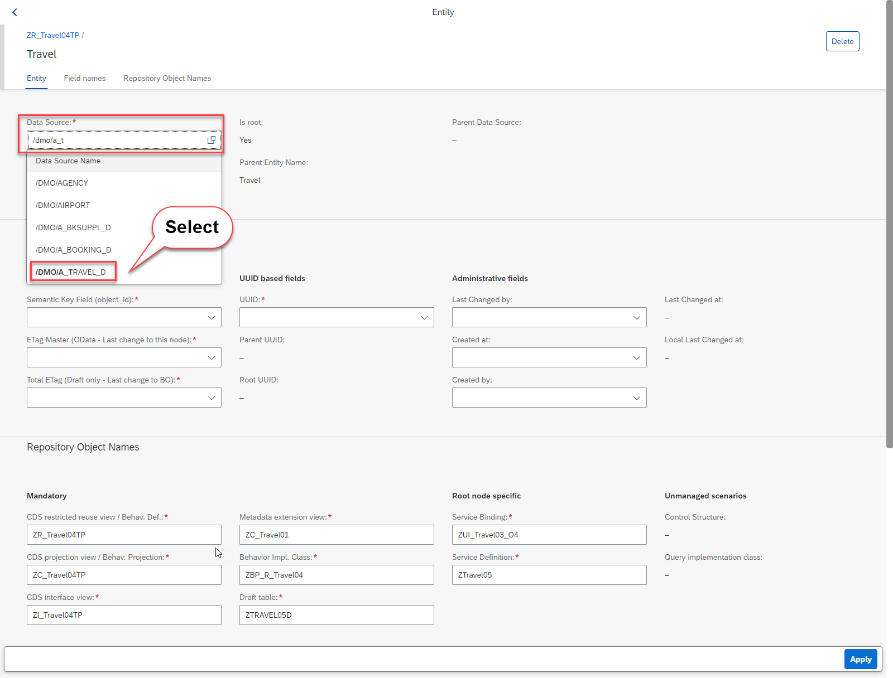

You first have to select the data source that shall be used by the root entity.

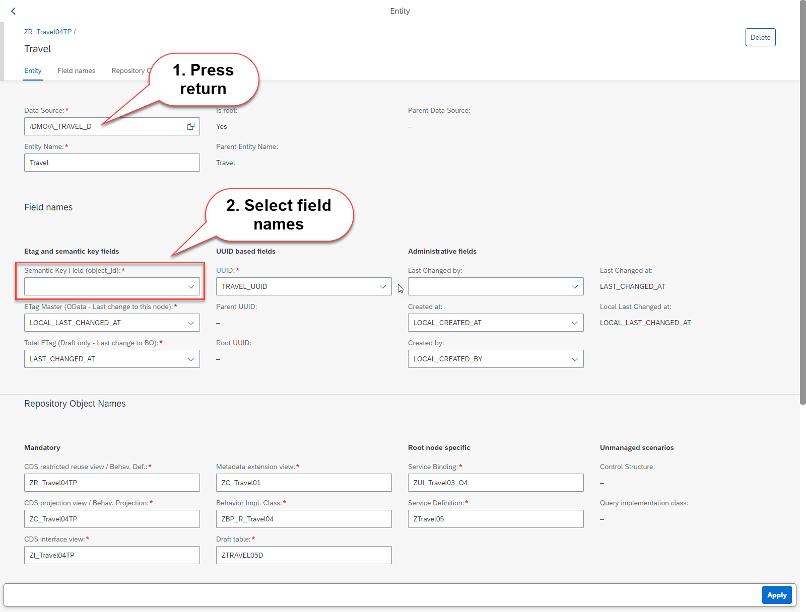

After you have selected the data source press **Return** to initiate a side effect. (This works for the SAP Fiori Elements OData V2 preview but not for the V4 preview. This is why I chose to use the V2 preview). As a result the generator will try to determine the names of the fields that perform certain roles such as the UUID based key field, the field used as the total etag, etc.

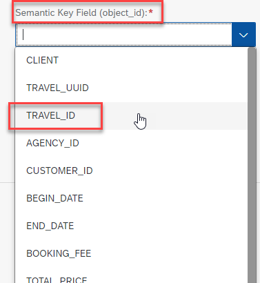

What can not be determined automatically is which field shall be used as the **semantic key**. 

Press **Apply** to return to the header object page.

### (optional) add one or more child or grand child entities)

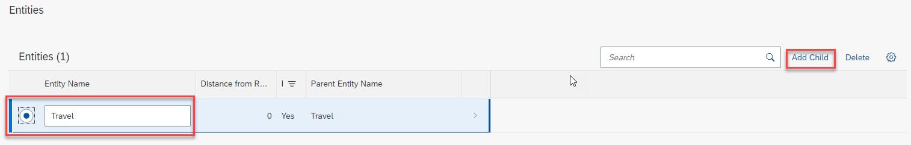

On the object page of our RAP business object we select the root entity Travel from the list of entities and used the action **Add Child**.  

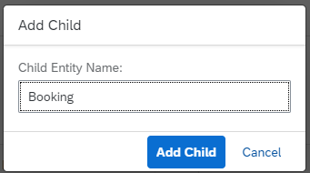  

In the popup you have to enter the **entity name of the child entity** (here Booking).

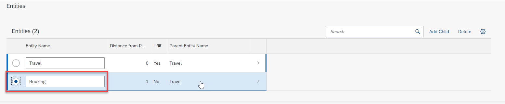  

You will see a new entry in the list of entities. Select the newly created entity **Booking** to navigate to the object page for the RAP BO nodes.  

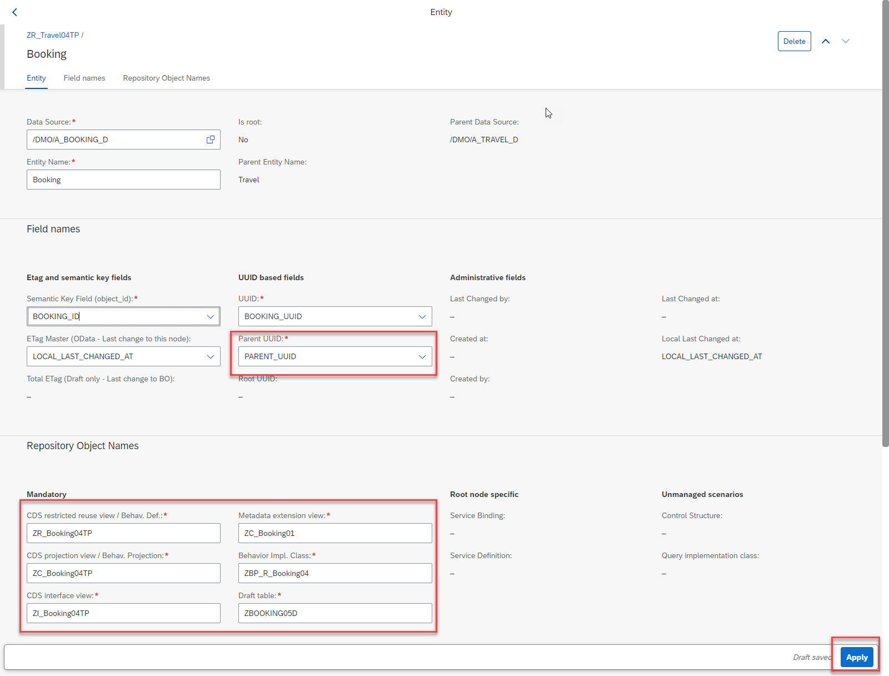  

After having selected the table **/DMO/A_BOOKING_D** as a data source and after having pressed **return** to start the determination of most fields and after having specified **BOOKING_ID** as the semantic key.  Press **Apply** to return to the (header) rap bo object page.

You can now press the **Create** button.  

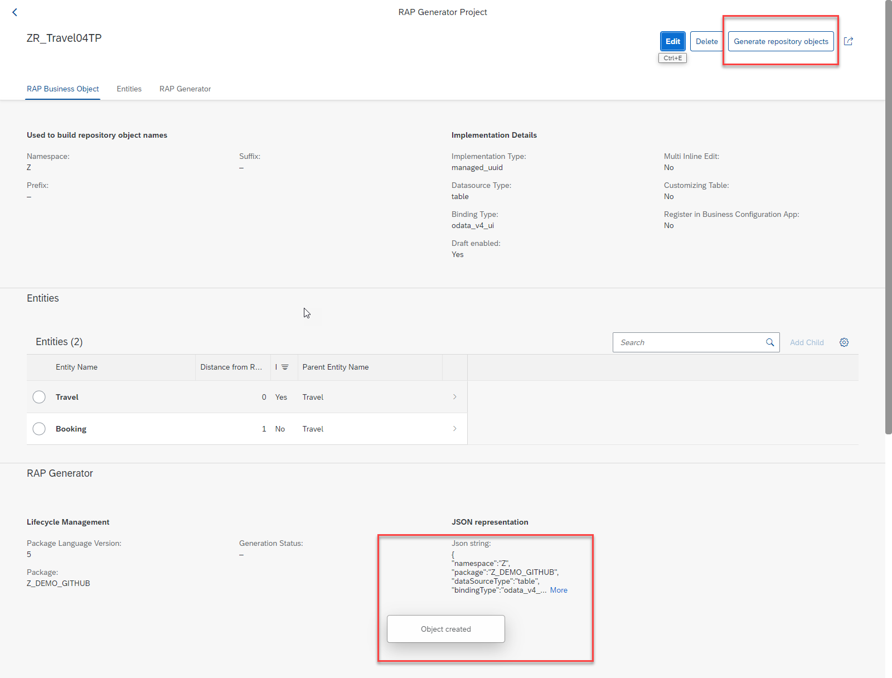

After having pressed the **Create** button the project is created and the json file that is used as an input for the RAP Generator has been created. And you will notice that a button **Generate repository objects** on the top of your page is now visible. 

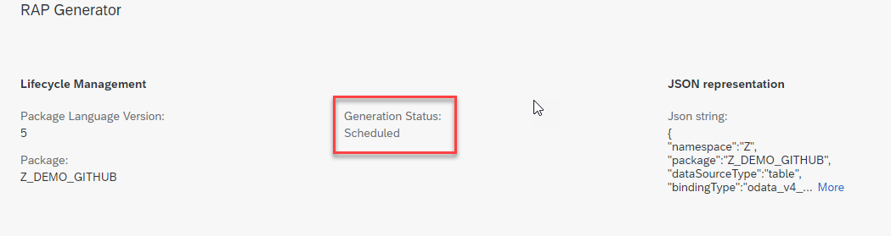

After having pressed the button to start the generation of repository objects you will see that the generation status changes to **Scheduled**. (Since RAP does not support to perform commit work statements in the interaction phase nor in the save sequence the RAP Generator is started technically in the background by running an application job).  

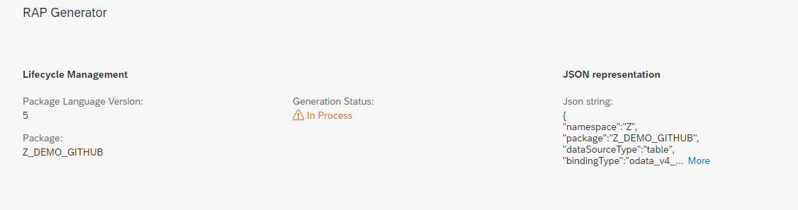

For the same reason (no commits allowed) it might take a while (up to several seconds) before the status changes to **in progress**.  

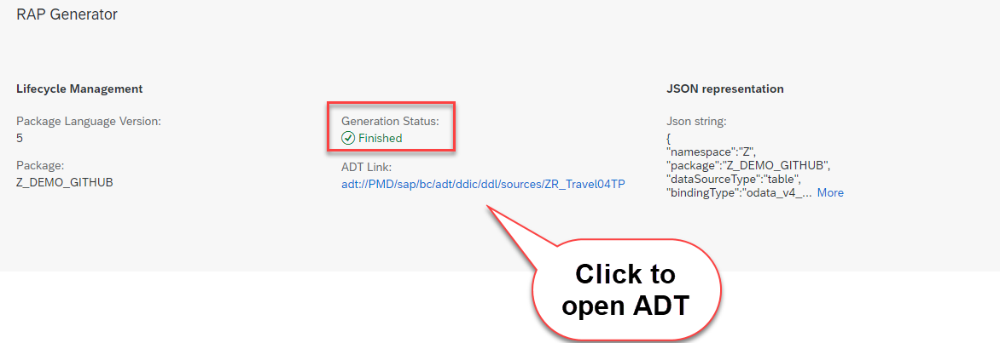

Finally you should see that the job has finished successfully. If this is the case you will also see an ADT link. 

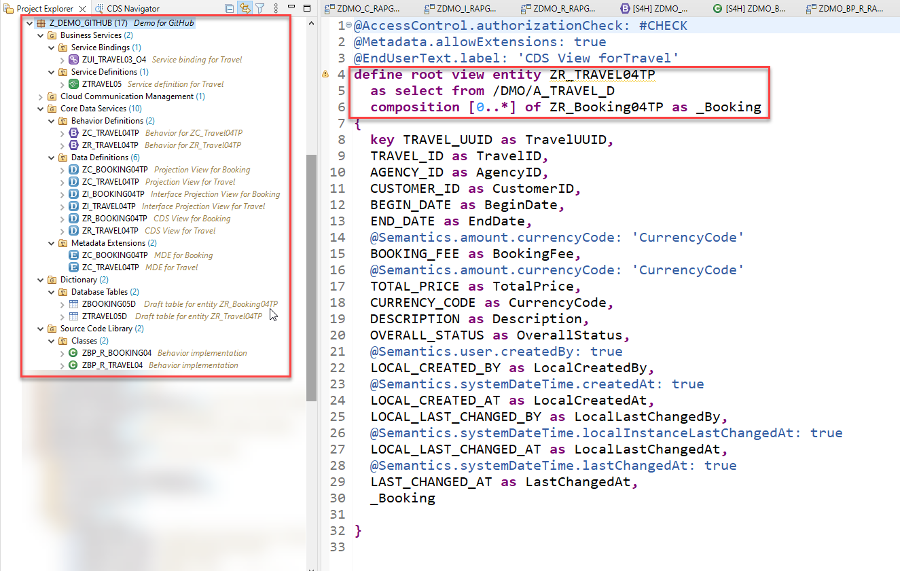

When clicking on the same you will navigate back to ADT thereby opening the root CDS view that has just been generated. 

## How to install the RAP Generator 

1. Create a package **'ZDMO_RAP_GENERATOR'**
2. Link this package with the URL of the RAP Generator repo
3. Pull changes
4. Use mass activation to activate the objects that have been imported in step 3
5. Run the class `zdmo_cl_rap_generator_setup`. This class generates the following objects
   - Application job catalog entry - ZDMO_RAP_GEN_CATATALOG_ENTRY 
   - Application job template - ZDMO_RAP_GEN_JOB_TEMPLATE
   - Application log object - ZDMO_RAP_GEN_APPLLOG
   - Service binding - ZDMO_UI_RAP_GENERATOR_O2
6. Activate the service binding ZDMO_UI_RAP_GENERATOR_O2

# Requirements

This sample code does currently only work in 
- SAP BTP, ABAP environment
- SAP S/4HANA 2021
- SAP S/4HANA 2020

Make sure you have set the following option "Wrap and escape text when pasting into string literal" for your ABAP source code editor in your ADT preferences as described in my blog [How to wrap long strings automatically in ADT](https://blogs.sap.com/2020/07/29/how-to-wrap-long-strings-automatically-in-adt/)

For more detailed information please also check out the following blog post:
https://blogs.sap.com/2020/05/17/the-rap-generator

# Download and Installation

When you want to install this sample code in your own ABAP Environment systems you can simply download it using the abapGIT plugin in ABAP Development Tools in Eclipse when working with SAP BTP, ABAP environment. 

For this you have to create a package in the Z-namespace (for example ZDMO_RAP_GENERATOR) and link it as an abapGit repository.

Please make sure that you use this URL

https://github.com/SAP-samples/cloud-abap-rap/tree/main

so that you have used the "main" branch.

It is also possible to install the RAP Generator in an on-premise system as of SAP S/4HANA 2020 FSP1. 

And for **on premise** systems you have to use the appropriate branch **on-premise-2020** https://github.com/SAP-samples/cloud-abap-rap/tree/On-Premise-2020  or **on-premise-2021** https://github.com/SAP-samples/cloud-abap-rap/tree/On-Premise-2020

# Known Issues

The sample code is provided "as-is".

It is currently not possible to set the names of the repository objects used by the virtual root node that is implicitly generated by the generator when using customizing tables with multi inline edit capabilities.

When using the RAP Generator in on premise systems you have to make sure that the latest SAPUI5 libraries are installed. If you don’t have the latest version of the SAPUI5 libraries installed you will get no dialogue when pressing the **New Project** button in the RAP Generator. If the latest SAPUI5 libraries cannot be installed you can use an implicit enhancment in method `get_sapui5core_resources_url( )` of class `CL_ADT_ODATAV2_FEAP` as described in the following blog post:

https://blogs.sap.com/2022/04/16/how-to-use-the-latest-sapui5-library-for-the-fiori-elements-preview-in-adt/

## on_premise_2020

- no support for abstract entities as a datasource because it is not possible to generate custom entities using the XCO framework in this release   
- only view entities are supported as a data source when **cds_view** is selected as a data source type   
- behavior implementation classes have to be generated manually using a quick fix in the BDEF editor in ADT  
- no generation of service bindings
- RAP Generator does not offer a mandatory fields support  

# How to obtain support
If you have problems or questions you can [post them in the SAP Community](https://answers.sap.com/questions/ask.html) using either the primary tag "[SAP BTP, ABAP environment](https://answers.sap.com/tags/73555000100800001164)" or "[ABAP RESTful Application Programming Model](https://answers.sap.com/tags/7e44126e-7b27-471d-a379-df205a12b1ff)".

# Contributing
You can add proposals for enhancements as issues. 

# License
Copyright (c) 2020 SAP SE or an SAP affiliate company. All rights reserved. This file is licensed under the Apache Software License, version 2.0 except as noted otherwise in the [LICENSE](LICENSE) file.
